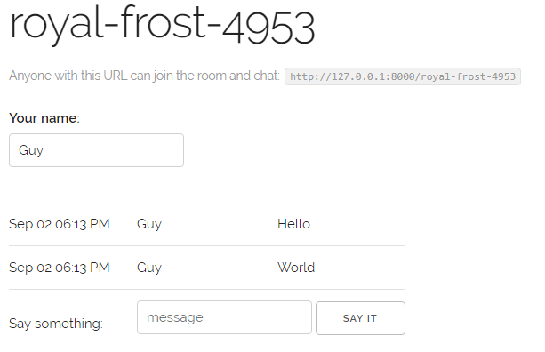

# Django-Chat
##### A chat web application built on top of websockets and [Django Channels.](https://channels.readthedocs.io/en/latest/)
  

## Usage
1. Install dependencies
`pip install -r requirements.txt`
2. Download [Redis](https://redis.io/) and start a server.
3. Start the chat server.
4. Add a worker `python manage.py runworker`.
5. Navigate to http://127.0.0.1:8000/ and start chatting!

Thanks to [Jacob Kaplan-Moss](https://blog.heroku.com/in_deep_with_django_channels_the_future_of_real_time_apps_in_django) for his tutorial
